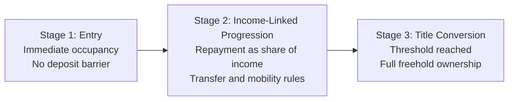

# Income Title Deck Draft: Sections 6 and 7

Single-file PPT agent handoff version: `proposal/slides_06_07_ppt_agent_handoff.md`.

## Slide 6: Policy Precedents We Can Borrow From

### Slide Objective
Show that the model is not a policy leap into the unknown. It combines two proven Australian policy logics:
- HECS style income-linked repayment discipline.
- PBS style structured purchaser and price-discipline discipline.

### On-Slide Headline
Proven Policy Logic, New Housing Application

### On-Slide Subheadline
Income Title combines HECS repayment design with PBS procurement discipline.

### Suggested Layout
- Left column: HECS principles.
- Right column: PBS principles.
- Center vertical bridge: Transfer to housing design.

### On-Slide Copy

#### Left Column: HECS Principles (Repayment Design)
- Access first, repayment later.
- Repayment tied to capacity to pay.
- Automatic collection architecture lowers friction.
- Public objective with private life outcomes.

#### Right Column: PBS Principles (Procurement Design)
- Government sets purchasing framework.
- Standard specifications reduce fragmentation.
- Price discipline via rules and disclosure.
- Scale buying power improves value for money.

#### Center Bridge: Transfer to Housing
- Access now: household moves in early.
- Pay by income: burden tracks earning capacity.
- Standard product: quality and cost consistency.
- Structured purchasing: competition on delivery, not marketing.

### Quant Benchmarks to Add on Slide 6 (High-Level)
Use 2-3 metrics only, shown as small callout chips under each column.

#### PBS Benchmark Chips (Savings and Scale)
- Annual subsidised script volume (high-level system scale).
- Annual PBS outlays (high-level purchasing scale).
- Cumulative savings from price disclosure and statutory price reductions (high-level savings proof point).

Suggested wording:
- "National single-buyer framework at very large annual scale."
- "Price discipline mechanisms have delivered multi-year savings to government and consumers."

Indicative numeric ranges to verify before publication:
- Annual scripts: approximately hundreds of millions per year.
- Annual PBS outlays: approximately tens of billions per year.
- Cumulative savings from pricing reforms: approximately multi-billion over time.

#### HECS Benchmark Chips (Access and Repayment Performance)
- Participation effect proxy: growth in tertiary participation/attainment over time.
- Stock and flow: outstanding HELP portfolio and annual compulsory repayments.
- Collection integrity: repayment through tax system (administrative efficiency proxy).

Suggested wording:
- "Large-scale income-linked repayment system already operating nationally."
- "Repayments collected annually through tax architecture, reducing default-style friction."

Indicative numeric ranges to verify before publication:
- HELP portfolio: approximately tens of billions outstanding.
- Annual compulsory repayment collection: approximately several billions per year.
- Higher education attainment (age cohorts): strong long-run uplift trend.

### Speaker Notes (Approximately 2 Minutes)
Australia already runs complex social systems with hard fiscal discipline.

HECS proved that income-linked repayment can preserve access while managing repayment burden over a long horizon. It lowered upfront barriers and aligned repayment with actual capacity.

PBS proved that when government defines a clear purchasing framework with transparent rules, it can create ongoing price discipline and better value outcomes.

Income Title takes one mechanism from each system. From HECS, it borrows the household-side repayment logic. From PBS, it borrows the system-side procurement logic.

That is the design insight: this is not a grant model and not conventional debt finance. It is a structured ownership pathway built from policy mechanics Australia already understands.

### Visual Build Specification
- Header band at top with headline and subheadline.
- Two equal cards left and right, each with four bullets.
- Center bridge column with four short transfer bullets and arrow icons.
- Color treatment:
  - HECS card: deep teal.
  - PBS card: burnt orange.
  - Bridge: charcoal with white icons.

### Data and Citation Notes for Presenter View
- Cite HECS as income-linked repayment precedent.
- Cite PBS as structured procurement and price discipline precedent.
- Keep this slide conceptual unless you add formal program metrics.
- If adding numbers, source from current Australian Government publications and add year labels on-slide.
- Do not mix year bases across metrics (for example, scripts from one year and savings from a different policy window) without noting the period.

---

## Slide 7: The Income Title Model in One Slide

### Slide Objective
Explain the full model in one visual lifecycle that an audience can understand in under 20 seconds.

### On-Slide Headline
Income Title Lifecycle: Enter, Repay by Income, Convert to Freehold

### On-Slide Subheadline
Occupancy starts immediately. Ownership is completed through structured income-linked repayment.

### Suggested Layout
Horizontal 3-step lifecycle schematic with short rule boxes beneath each stage:
- Stage 1: Entry.
- Stage 2: Income-linked progression.
- Stage 3: Title conversion.

### On-Slide Copy

#### Stage 1: Entry
- Eligible household allocated compliant home.
- No deposit barrier.
- Immediate occupancy rights begin.

#### Stage 2: Income-Linked Progression
- Annual contribution set as a share of household income.
- Standard administration and compliance rules apply.
- Mobility pathways exist for transfer or sale before completion.

#### Stage 3: Title Conversion
- When repayment threshold is reached, title converts.
- Household holds full freehold ownership.
- Scheme balance closes for that dwelling.

### Rule Bar (Single Line Along Bottom)
Clear entry rules. Predictable repayment rules. Automatic conversion rules.

### Speaker Notes (Approximately 2 Minutes)
This slide is the full model in one line.

At entry, the household gets immediate occupancy without a deposit hurdle. That solves the front-end exclusion problem in the current system.

During progression, payments are linked to income rather than fixed mortgage servicing. That means burden scales with capacity, making the pathway more resilient to income variability.

At conversion, the legal endpoint is explicit. Once the repayment threshold is met under the scheme rules, title converts to freehold.

This gives households clarity, gives government an auditable framework, and gives the delivery system a repeatable model that can be scaled.

### Visual Build Specification
- Three large numbered nodes connected left to right by thick arrows.
- Icon set:
  - Entry: house and key.
  - Progression: income bars and calendar.
  - Conversion: title certificate and checkmark.
- Small compliance badges under Stage 2 and Stage 3.
- Bottom rule bar in contrasting color.

### Mermaid Draft for Designer Handoff

### Presenter Guidance
- Spend 35 to 40 seconds per stage.
- Do not drift into legal detail here.
- Keep legal and financial technicalities in appendix backup slides.

---

## Optional Pairing Tip
Run Slide 6 then Slide 7 without interruption.
- Slide 6 answers: Why this design is credible.
- Slide 7 answers: How the model works in practice.
