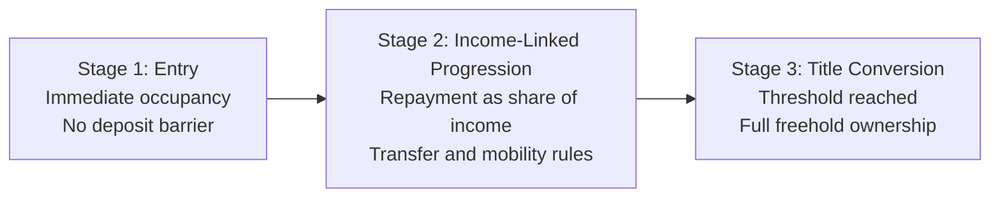

# PPT Agent Handoff: Slides 6 and 7 (Single Source)

## Purpose
This is the single handoff document to generate design-ready Slides 6 and 7.
It contains:
- Final slide copy.
- Layout and visual direction.
- Speaker notes.
- Quant chips with locked benchmark values.
- Source tags for citation line items.

Use this document as the sole build input for the deck agent.

---

## Global Design Direction
- Tone: policy-serious, clean, modern.
- Visual style: sharp cards, simple icons, minimal decorative clutter.
- Typography: high contrast headline + compact body text.
- Chart style: flat color chips and simple arrows, no heavy 3D effects.
- Color roles:
  - HECS: deep teal.
  - PBS: burnt orange.
  - Income Title bridge/lifecycle connectors: charcoal.

---

## Slide 6
### Slide ID
6

### Slide Title
Policy Precedents We Can Borrow From

### Slide Headline
Proven Policy Logic, New Housing Application

### Slide Subheadline
Income Title combines HECS repayment design with PBS procurement discipline.

### Core Message
Income-linked and structured procurement systems already work in Australia.

### Layout
- Left column card: HECS principles and HECS quant chips.
- Right column card: PBS principles and PBS quant chips.
- Center vertical bridge: transfer-to-housing logic.

### On-Slide Body Copy

#### Left Card Header
HECS Principles (Repayment Design)

#### Left Card Bullets
- Access first, repayment later.
- Repayment tied to capacity to pay.
- Automatic collection architecture lowers friction.
- Public objective with private life outcomes.

#### Right Card Header
PBS Principles (Procurement Design)

#### Right Card Bullets
- Government sets purchasing framework.
- Standard specifications reduce fragmentation.
- Price discipline via rules and disclosure.
- Scale buying power improves value for money.

#### Center Bridge Header
Transfer to Housing

#### Center Bridge Bullets
- Access now: household moves in early.
- Pay by income: burden tracks earning capacity.
- Standard product: quality and cost consistency.
- Structured purchasing: competition on delivery, not marketing.

### Quant Chips (Place under cards)
Use 2 chips under HECS, 2 chips under PBS.

#### HECS Chips
- Income-contingent model in operation since 1989.
- Bachelor degree or above: 26% (2016) -> 34% (2025).

Optional third HECS chip:
- Employment outcome differential (2025): 80% employed with non-school qualification vs 58% without.

#### PBS Chips
- Annual subsidised prescriptions: 226.0 million (2024-25).
- Government PBS expenditure: $19.1 billion (2024-25).

Optional third PBS chip:
- Recent patient savings measures: estimated >$0.5 billion per year combined (co-payment, safety net, 60-day supply measures).

### Presenter Notes (2 minutes)
Australia already runs complex social systems with hard fiscal discipline.

HECS demonstrates that income-linked repayment can preserve access while managing burden over time. PBS demonstrates that a clear purchasing framework with transparent rules can sustain long-term price discipline.

Income Title combines those logics. From HECS, household repayment scales with capacity. From PBS, system delivery uses rules, benchmarking, and disciplined procurement.

This is why the model is credible: it adapts proven Australian mechanisms rather than inventing an untested structure from scratch.

### Build Instructions for Designer
- Use two equal vertical cards with a narrow center bridge strip.
- Keep body bullets at 4 lines per card maximum.
- Render quant chips as small rounded rectangles with bold number first, label second.
- Add footnote line for source year labels.

### Footnote Format
Sources: Australian Government program statistics, latest available year. Align all metrics to labeled year windows.

Source year tags to place in speaker notes:
- PBS expenditure and scripts: PBS Expenditure and Prescriptions Report 2024-25.
- PBS patient savings estimates: PBS Expenditure and Prescriptions Report 2023-24 (recent patient cost saving measures).
- HECS context and education outcomes: ABS Education and Work, Australia 2025.

---

## Slide 7
### Slide ID
7

### Slide Title
The Income Title Model in One Slide

### Slide Headline
Income Title Lifecycle: Enter, Repay by Income, Convert to Freehold

### Slide Subheadline
Occupancy starts immediately. Ownership is completed through structured income-linked repayment.

### Core Message
Occupy now, repay by income, convert to freehold on completion.

### Layout
- Horizontal 3-step lifecycle.
- Three large nodes with arrows left to right.
- Short rule box under each stage.
- Bottom rule bar across full width.

### On-Slide Stage Copy

#### Stage 1: Entry
- Eligible household allocated compliant home.
- No deposit barrier.
- Immediate occupancy rights begin.

#### Stage 2: Income-Linked Progression
- Annual contribution set as a share of household income.
- Standard administration and compliance rules apply.
- Mobility pathways exist for transfer or sale before completion.

#### Stage 3: Title Conversion
- When repayment threshold is reached, title converts.
- Household holds full freehold ownership.
- Scheme balance closes for that dwelling.

### Locked Numeric Callouts for Slide 7
These values are already defined in project material and can be used now:
- Target delivered cost per home: approximately $350,000.
- Indicative split: approximately $100,000 serviced land + approximately $250,000 construction.
- Payment rate: 10-12% of household income.
- Minimum payment: $8,000-$10,000 per year.
- Repayment cap trigger: approximately $300,000 indexed.
- Typical completion pathway: approximately 10-15 years for many cohorts.

### Bottom Rule Bar Text
Clear entry rules. Predictable repayment rules. Automatic conversion rules.

### Presenter Notes (2 minutes)
At entry, the household gets immediate occupancy without a deposit hurdle.

During progression, payments are income-linked rather than fixed mortgage servicing, improving resilience through income variability.

At conversion, once the repayment threshold is met under scheme rules, title converts to full freehold.

This creates clarity for households, auditable administration for government, and repeatable delivery logic for scale.

### Build Instructions for Designer
- Node icons:
  - Entry: house + key.
  - Progression: income bars + calendar.
  - Conversion: title certificate + checkmark.
- Show numeric callouts as side panel or top-right chip cluster.
- Keep this slide under 35 visible words per stage block.

### Mermaid Structure Draft

---

## Data Block for Final Number Fill
Final values used in this handoff (no placeholders):

- HECS model start year = 1989
- HECS_ATTAINMENT_START = 26%
- HECS_ATTAINMENT_END = 34%
- HECS_ATTAINMENT_PERIOD = 2016 to 2025
- HECS_EMPLOYMENT_WITH_QUAL = 80%
- HECS_EMPLOYMENT_WITHOUT_QUAL = 58%

- PBS_ANNUAL_SCRIPTS_M = 226.0
- PBS_ANNUAL_OUTLAYS_AUD_BN = 19.1
- PBS_PATIENT_SAVINGS_COMBINED_AUD_M = >500 (high-level estimate from listed measure totals)
- PBS_BASE_YEAR = 2024-25 (scripts/outlays), 2023-24 (savings measures)

---

## Source Pack to Attach
For number assurance, attach one source note page to the deck build with year labels:
- Australian Government statistics pages for PBS scripts and outlays.
- ABS Education and Work release for attainment and employment differentials.
- Use HELP portfolio and repayment values only if you add a third HECS slide or appendix sourced from current HELP statistical publication.

---

## Ready State
- Slide architecture: ready.
- Slide copy: ready.
- Speaker notes: ready.
- Visual instructions: ready.
- Numeric fill status: complete for production of Slides 6 and 7.
